# Consumo de API Laravel

## 1. Instalación y Descarga

Para ejecutar este proyecto localmente, necesitas tener instalado Node.js y npm (Node Package Manager).

**Pasos para la instalación:**

1.  **Clonar el repositorio:**

    ```bash
    git clone https://github.com/raul-tecnmito/productos-angular.git
    ```

2.  **Navegar al directorio del proyecto:**

    ```bash
    cd productos-angular
    ```

3.  **Instalar las dependencias:**

    ```bash
    npm install
    ```

    Este comando instalará todas las dependencias necesarias listadas en el archivo `package.json`.

4.  **Ejecutar la aplicación:**

    ```bash
    ng serve
    ```

    Este comando iniciará el servidor de desarrollo de Angular. La aplicación estará disponible en `http://localhost:4200/`.

## 2. Proceso de Desarrollo y Estructura del Proyecto

Este proyecto fue iniciado utilizando el Angular CLI (Command Line Interface), que genera la estructura base de una aplicación Angular. A continuación, se describe la estructura del proyecto y los archivos añadidos para la funcionalidad de gestión de productos y usuarios.

### 2.1 Estructura del Proyecto

#### 2.1.1 Creacion de los Servicios

Se crean los servicios para el consumo de nuestra API:

```bash
ng generate service Usuarios

ng generate service Users

ng generate service Products
```

#### 2.1.2 Creacion de Componentes

Planteado el proyecto, se comienza con la creación de los componentes a utilizar, utilizando los siguientes comandos:

```bash
ng generate component Dashboard

ng generate component Usuarios

ng generate component UserView

ng generate component UserForm

ng generate component borrar-confirmacion
```

### 2.2 Consumo de API

#### 2.2.1 Usuarios
##### Usuarios Service
Se define el consumo de la API, considerando la autenticacion del usuario.
```typescript
export class UsuariosService {
  login(email: string, password: string): Observable<boolean> {
    return new Observable<boolean>((observer) => {
      this.httpClient.post<{ token: string; user: Usuario }>(this.LOGIN_ENDPOINT, { email, password }).subscribe({
        next: (response) => {
          const { token, user } = response;

          localStorage.setItem("auth.token", token);
          localStorage.setItem("isAuthenticated", "true");
          localStorage.setItem("auth.user.id", user.id.toString());
          localStorage.setItem("auth.user.email", user.email);
          localStorage.setItem("auth.user.name", user.name);
          if (user.image_url) localStorage.setItem("auth.user.avatar", user.image_url);

          observer.next(true);
          observer.complete();
        },
        error: (err) => {
          observer.next(false);
          console.log(err);
          observer.complete();
        },
      });
    });
  }

  logout(): Observable<boolean> {
    return new Observable<boolean>((observer) => {
      const token = localStorage.getItem("auth.token");
      if (!token) {
        observer.next(false);
        observer.complete();
        return;
      }

      this.httpClient
        .post(
          this.LOGOUT_ENDPOINT,
          {},
          {
            headers: { Authorization: `Bearer ${token}` },
          }
        )
        .subscribe({
          next: () => {
            this.clearAuthData();
            observer.next(true);
            observer.complete();
          },
          error: (err) => {
            console.error("Error en el logout: ", err);
            this.clearAuthData();
            observer.next(false);
            observer.complete();
          },
        });
    });
  }

  private clearAuthData(): void {
    localStorage.removeItem("auth.token");
    localStorage.removeItem("isAuthenticated");
    localStorage.removeItem("auth.user.id");
    localStorage.removeItem("auth.user.email");
    localStorage.removeItem("auth.user.name");
    localStorage.removeItem("auth.user.role");
    localStorage.removeItem("auth.user.avatar");
  }
}
```
Este metodo nos permite desautenticar al usuario, despues del logout.
 ```typescript 
 private clearAuthData(): void
 ```

#### 2.2.2 CRUD de Usuarios
##### UserService
Para el manejo de usuarios, se definen los metodos `getUsers()`, `getUser()`, `createUser()`, `updateUser()`, `deleteUser()`, con su respectiva lógica, ademas de definir el endpoint de la API:

```typescript
export class UserService {
  private apiUrl = 'http://localhost:8000/api/users';

  constructor(private http: HttpClient) {}

  getUsers(): Observable<User[]> {
    return this.http.get<User[]>(this.apiUrl);
  }

  getUser(id: number): Observable<User> {
    return this.http.get<User>(`${this.apiUrl}/${id}`);
  }

  createUser(user: User): Observable<User> {
    return this.http.post<User>(this.apiUrl, user);
  }

  updateUser(id: number, user: User): Observable<User> {
    return this.http.put<User>(`${this.apiUrl}/${id}`, user);
  }

  deleteUser(id: number): Observable<void> {
    return this.http.delete<void>(`${this.apiUrl}/${id}`);
  }
}
```
##### Mostrando Usuarios
Para mostrar usuarios se crea una tabla, ademas de integrar la paginacion y un sort en cada columna:
```HTML
<div class="user-table">
    <h2>Lista de usuarios</h2>
    
    <mat-form-field style="width: 100%;">
      <mat-label>Filtrar usuarios</mat-label>
      <input matInput (keyup)="applyFilter($event)" placeholder="Ejemplo: jose" #input>
    </mat-form-field>
  
    <table mat-table [dataSource]="dataSource" matSort matSortActive="id" matSortDirection="asc" matSortDisableClear>
      
      <!-- Columnas -->
      <ng-container matColumnDef="id">
        <th mat-header-cell *matHeaderCellDef mat-sort-header>ID</th>
        <td mat-cell *matCellDef="let user">{{ user.id }}</td>
      </ng-container>
  
      <ng-container matColumnDef="name">
        <th mat-header-cell *matHeaderCellDef mat-sort-header>Nombre</th>
        <td mat-cell *matCellDef="let user">{{ user.name }}</td>
      </ng-container>

      <ng-container matColumnDef="email">
        <th mat-header-cell *matHeaderCellDef mat-sort-header>Email</th>
        <td mat-cell *matCellDef="let user">{{ user.email }}</td>
      </ng-container>
  
      <ng-container matColumnDef="image_url">
        <th mat-header-cell *matHeaderCellDef mat-sort-header>Imagen</th>
        <td mat-cell *matCellDef="let user">
          
        </td>
      </ng-container>
  
      <ng-container matColumnDef="actions" style="width: max-content;">
        <th mat-header-cell *matHeaderCellDef>Acciones</th>
        <td mat-cell *matCellDef="let user">
          <button mat-icon-button color="primary" (click)="openModal(user)">
            <mat-icon>edit</mat-icon>
          </button>
          <button mat-icon-button color="warn" (click)="openBorrar(user.id)">
            <mat-icon>delete</mat-icon>
          </button>
          <button mat-icon-button color="accent" (click)="viewUser(user)">
            <mat-icon fontIcon="visibility"></mat-icon>
          </button>
        </td>
      </ng-container>
  
      <tr mat-header-row *matHeaderRowDef="displayedColumns"></tr>
      <tr mat-row *matRowDef="let row; columns: displayedColumns;"></tr>
    </table>
  
    <mat-paginator [pageSizeOptions]="[3, 5, 10]" showFirstLastButtons></mat-paginator>
  </div>
```

##### Editando Usuarios
Se hace uso de un modal para mostrar un form que nos permite modificar los usuarios. Validando cada uno de los datos que se ingresan.

```typescript
export class UserFormComponent {
  userForm: FormGroup;

  constructor(
    private fb: FormBuilder,
    private dialogRef: MatDialogRef<UserFormComponent>,
    @Inject(MAT_DIALOG_DATA) public data: User | null
  ) {
    this.userForm = this.fb.group({
      name: [data?.name || '', Validators.required],
      email: [data?.email || '', [Validators.required, Validators.email]],
      image_url: [data?.image_url || '', [Validators.required, Validators.pattern(/^https?:\/\//)]],
      password: [data?.password || '', [Validators.min(8)]],
    });
  }

  save(): void {
    if (this.userForm.valid) {
      this.dialogRef.close(this.userForm.value);
    }
  }

  close(): void {
    this.dialogRef.close();
  }
}
```

La plantilla es la siguiente:

```HTML
<div style="background-color: rgb(221, 238, 252);">
    <h2 mat-dialog-title>{{ data ? 'Editar Producto' : 'Agregar Producto' }}</h2>
    <mat-dialog-content>
      <button mat-icon-button class="close-button" (click)="close()">
        <mat-icon>close</mat-icon>
      </button>
      <form [formGroup]="userForm">
        <!-- Nombre -->
        <mat-form-field appearance="fill" class="full-width">
          <mat-label>Nombre</mat-label>
          <input matInput formControlName="name" />
        </mat-form-field>
  
        <!-- Email -->
        <mat-form-field appearance="fill" class="full-width">
          <mat-label>Email</mat-label>
          <input matInput type="text" formControlName="email" />
        </mat-form-field>
  
        <!-- Imagen URL -->
        <mat-form-field appearance="fill" class="full-width">
          <mat-label>URL  de Imagen</mat-label>
          <textarea matInput formControlName="image_url"></textarea>
        </mat-form-field>
  
        <!-- Contraseña -->
        <mat-form-field appearance="fill" class="full-width">
          <mat-label>Contraseña (deja en blanco para no actualizar)</mat-label>
          <input matInput type="password" formControlName="password" />
        </mat-form-field>
      </form>
    </mat-dialog-content>
    <mat-dialog-actions align="end">
      <button mat-button (click)="close()">Cancelar</button>
      <button mat-raised-button color="primary" (click)="save()" [disabled]="userForm.invalid">Guardar</button>
    </mat-dialog-actions>
  </div>
  
```

#### 2.2.3 CRUD de Productos

##### Products Service
Para el consumo de productos, al igual que con los usuario, se define metodos que permiten realizar un "CRUD" con los datos que consumimos de la API:
```typescript
export class ProductService {
  private baseUrl: string = 'http://localhost:8000/api/productos';

  constructor(private httpClient: HttpClient) {}

  getProductList(): Observable<Product[]> {
    return this.httpClient.get<Product[]>(this.baseUrl);
  }

  getProductById(id: number): Observable<Product> {
    return this.httpClient.get<Product>(`${this.baseUrl}/${id}`);
  }

  addProduct(data: Product): Observable<Product> {
    return this.httpClient.post<Product>(this.baseUrl, data);
  }

  updateProduct(id: number, data: Partial<Product>): Observable<Product> {
    return this.httpClient.put<Product>(`${this.baseUrl}/${id}`, data);
  }

  deleteProduct(id: number): Observable<void> {
    return this.httpClient.delete<void>(`${this.baseUrl}/${id}`);
  }
}
``` 

##### Mostrando Productos
Para mostrar los productos que consumimos de la API de igual manera, utilizamos una tabla, con su respectivo sort y paginator.

```HTML
<div class="product-table">
  <h2>Lista de productos</h2>
  
  <mat-form-field style="width: 100%;">
    <mat-label>Filtrar productos</mat-label>
    <input matInput (keyup)="applyFilter($event)" placeholder="Ejemplo: Producto" #input>
  </mat-form-field>

  <table mat-table [dataSource]="dataSource" matSort matSortActive="nombre" matSortDirection="asc" matSortDisableClear>
    
    <!-- Columnas -->
    <ng-container matColumnDef="id">
      <th mat-header-cell *matHeaderCellDef mat-sort-header>ID</th>
      <td mat-cell *matCellDef="let product">{{ product.id }}</td>
    </ng-container>

    <ng-container matColumnDef="nombre">
      <th mat-header-cell *matHeaderCellDef mat-sort-header>Nombre</th>
      <td mat-cell *matCellDef="let product">{{ product.nombre }}</td>
    </ng-container>

    <ng-container matColumnDef="descripcion">
      <th mat-header-cell *matHeaderCellDef mat-sort-header>Descripción</th>
      <td mat-cell *matCellDef="let product">{{ product.descripcion }}</td>
    </ng-container>

    <ng-container matColumnDef="precio">
      <th mat-header-cell *matHeaderCellDef mat-sort-header>Precio</th>
      <td mat-cell *matCellDef="let product">{{ product.precio | currency }}</td>
    </ng-container>

    <ng-container matColumnDef="actions" style="width: max-content;">
      <th mat-header-cell *matHeaderCellDef>Acciones</th>
      <td mat-cell *matCellDef="let product">
        <button mat-icon-button color="primary" (click)="openModal(product)">
          <mat-icon>edit</mat-icon>
        </button>
        <button mat-icon-button color="warn" (click)="openBorrar(product.id)">
          <mat-icon>delete</mat-icon>
        </button>
        <button mat-icon-button color="accent" (click)="viewProduct(product)">
          <mat-icon fontIcon="visibility"></mat-icon>
        </button>
      </td>
    </ng-container>

    <tr mat-header-row *matHeaderRowDef="displayedColumns"></tr>
    <tr mat-row *matRowDef="let row; columns: displayedColumns;"></tr>
  </table>

  <mat-paginator [pageSizeOptions]="[5, 10, 20]" showFirstLastButtons></mat-paginator>
</div>
```

#### 2.2.4 Eliminar Datos
Para eliminar datos, en ambos casos se reutiliza el modal de confirmacion `borrar-confirmacion`. Evitando asi duplicar un componente, que facilmente puede ser reutilizado.

```typescript
export class BorrarConfirmacion {
  readonly dialogRef = inject(MatDialogRef<BorrarConfirmacion>);
  
  closeDialog(result: boolean): void {
    this.dialogRef.close(result);
  }
}
```

Esta es la plantilla reutilizada:

```HTML
<h2 mat-dialog-title>Modal de confirmación</h2>
<mat-dialog-content>
  <p>¿Seguro que quieres borrar?</p>
</mat-dialog-content>
<mat-dialog-actions>
  <button mat-button (click)="closeDialog(false)">No</button>
  <button mat-button (click)="closeDialog(true)" cdkFocusInitial>Sí</button>
</mat-dialog-actions>
```

### 2.3 Rutas
En general, se utilizaron 2 rutas que permiten la navegación entre los diferentes paneles de nuestro sistema.

```typescript
export const routes: Routes = [
    { path: 'dashboard', component: DashboardComponent },
    { path: 'usuarios', component: UsuariosComponent },
];
```

## 3. Resultados

### Login con autenticacion de Usuarios.
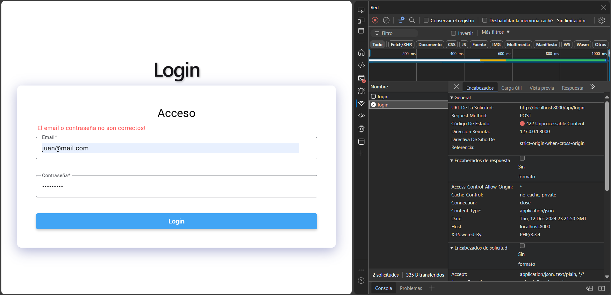

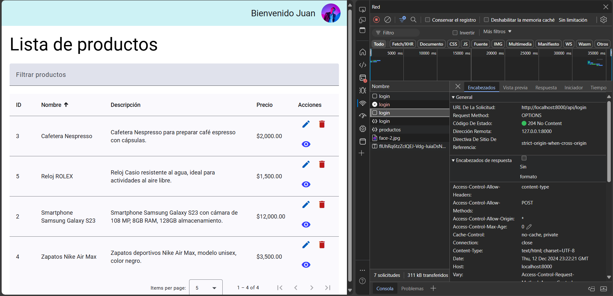

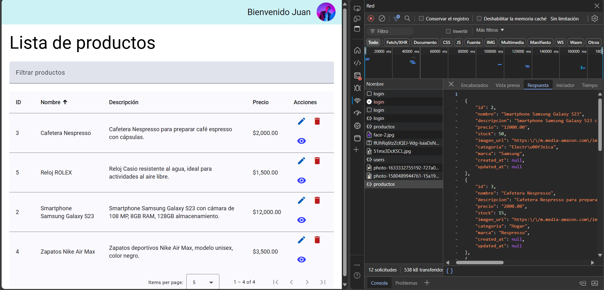

### CRUD de Productos
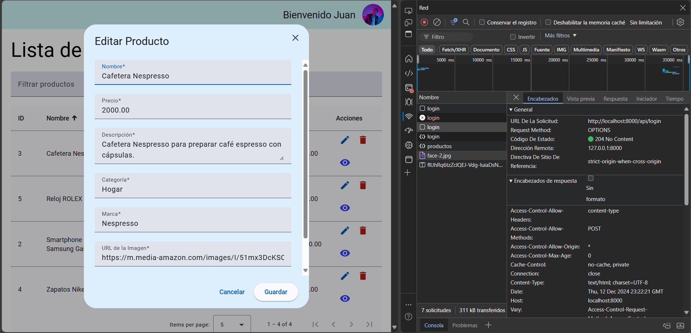

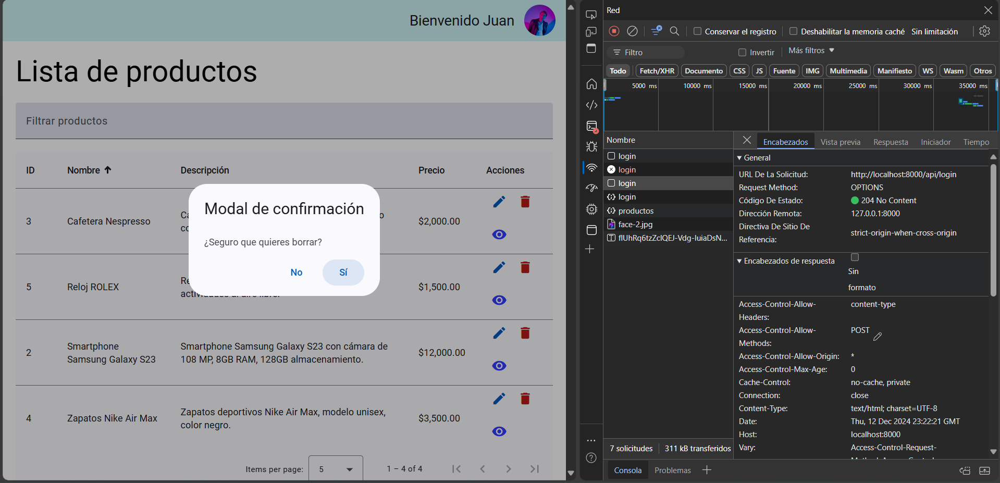

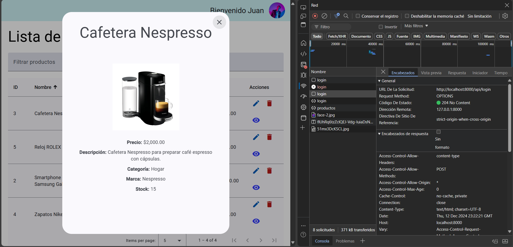

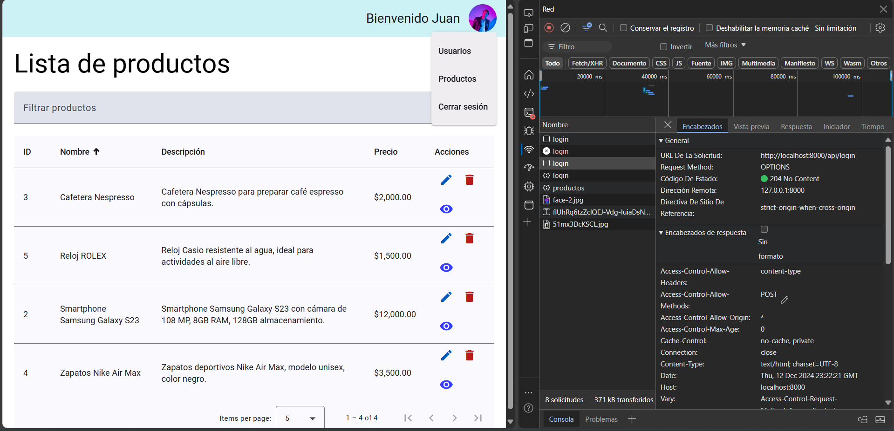

### CRUD de Usuarios
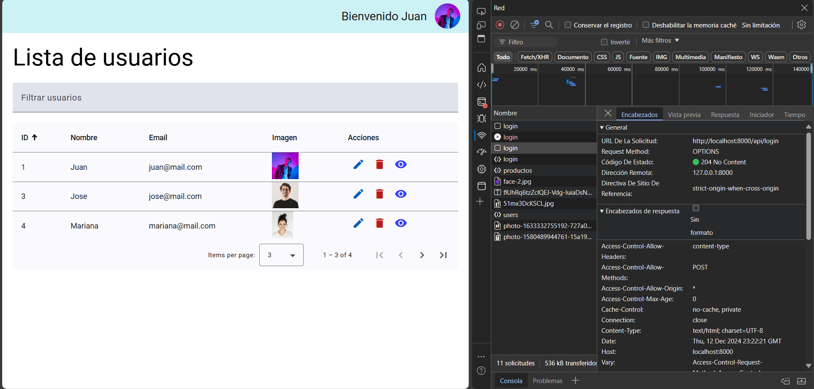

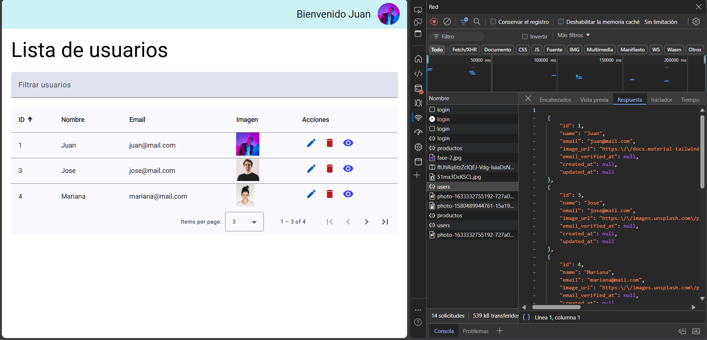

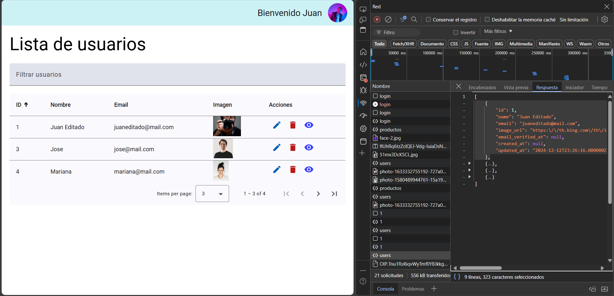

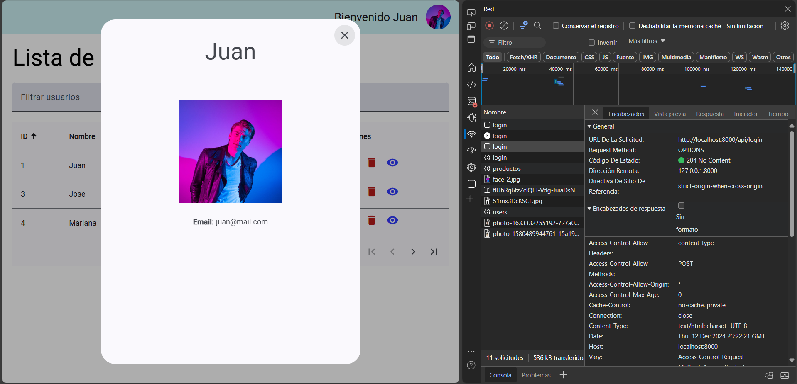

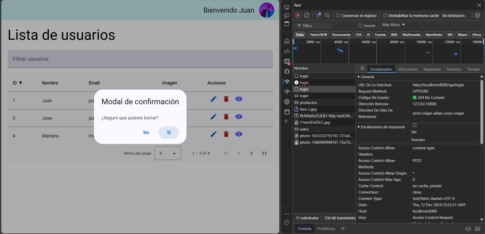

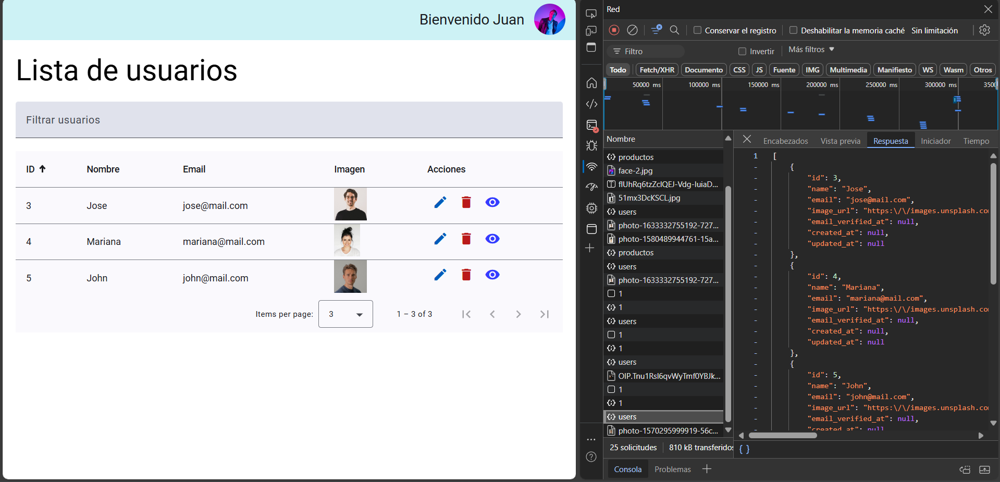

### LogOut
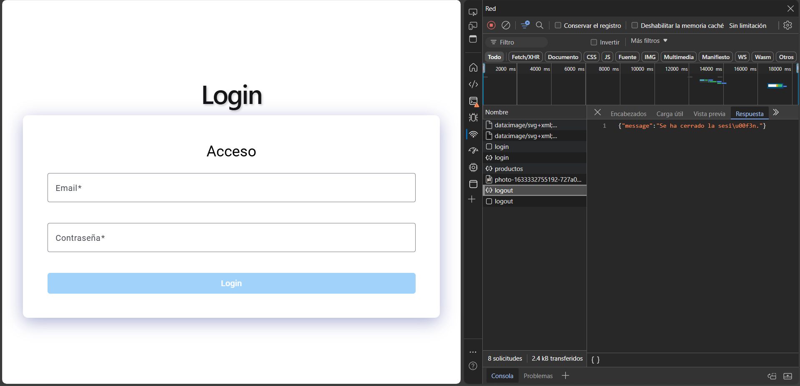


